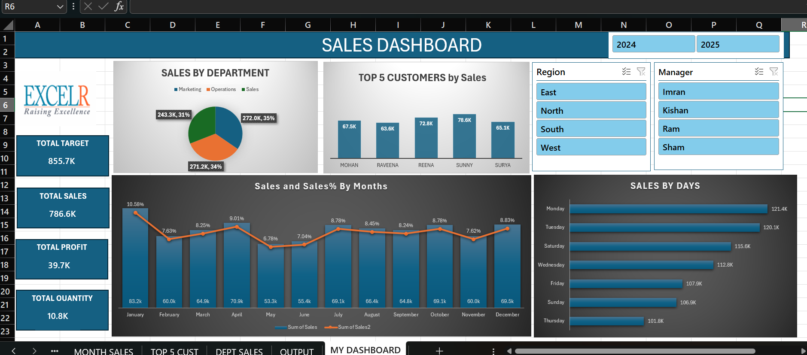
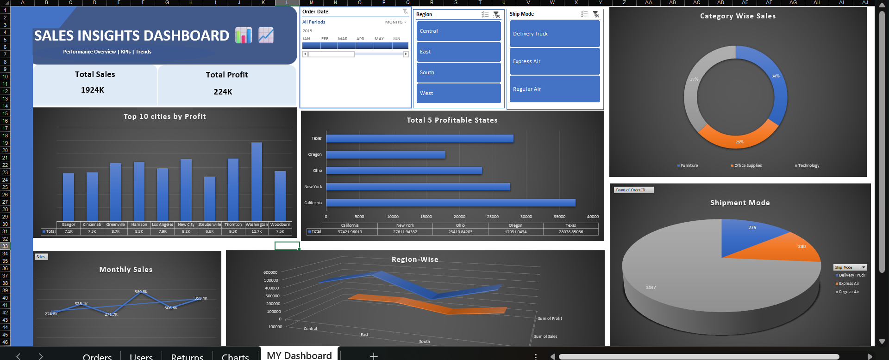

# 📊 Sales Dashboards - Excel

## 📌 Project Overview

This repository contains **2 interactive Sales Dashboards** built using **Microsoft Excel** to analyze and visualize key sales metrics including Total Sales, Profit, Quantity, Regional Performance, and Customer Insights.

---

## 📂 Dashboards Included

### 1️⃣ Sales Dashboard 1 — Performance Overview

> Analyzes sales performance across departments, regions, and managers

**📸 Dashboard Preview:**



**Key Metrics:**

- 🎯 Total Target — 855.7K
- 💰 Total Sales — 786.6K
- 📈 Total Profit — 39.7K
- 📦 Total Quantity — 10.8K

**Features:**

- Sales by Department (Marketing, Operations, Sales)
- Top 5 Customers by Sales
- Sales & Sales% by Months (Jan–Dec)
- Sales by Days of the Week
- Interactive filters by Region & Manager
- Year comparison (2024 vs 2025)

---

### 2️⃣ Sales Insights Dashboard 2 — Deep Dive Analysis

> Provides deep insights into profitability, regional performance, and shipment modes

**📸 Dashboard Preview:**



**Key Metrics:**

- 💰 Total Sales — 1924K
- 📈 Total Profit — 224K

**Features:**

- Top 10 Cities by Profit
- Top 5 Profitable States
- Category Wise Sales (Furniture, Office Supplies, Technology)
- Shipment Mode Analysis (Delivery Truck, Express Air, Regular Air)
- Monthly Sales Trend
- Region-Wise Performance (Central, East, South, West)
- Interactive filters by Order Date, Region & Ship Mode

---

## 🛠️ Tools & Technologies

| Tool                   | Purpose                            |
| ---------------------- | ---------------------------------- |
| Microsoft Excel        | Dashboard creation & visualization |
| Pivot Tables           | Data summarization & analysis      |
| Power Query            | Data cleaning & transformation     |
| Slicers                | Interactive filtering              |
| Charts & Graphs        | Data visualization                 |
| Conditional Formatting | Visual highlights                  |

---

## 💡 Key Insights

### Dashboard 1

- 📊 Sales department contributes **35%** of total sales
- 👤 **Sunny** is the top customer with **78.6K** sales
- 📅 **January** has the highest sales percentage at **10.58%**
- 📆 **Monday** is the best performing day with **121.4K** sales

### Dashboard 2

- 🏙️ **Washington** is the top city by profit
- 🗺️ **Texas** leads among the top 5 profitable states
- 🚚 **Regular Air** is the most used shipment mode
- 🪑 **Technology** category drives the highest sales percentage

---

## 🚀 How to Use

1. Download the `.xlsx` files from this repository
2. Open in **Microsoft Excel** (2016 or later recommended)
3. Use the **Slicers** to filter by Region, Manager, Date, Ship Mode
4. Navigate through different sheets for detailed analysis

---

## 📁 Repository Structure

```
📁 Sales-Dashboards-Excel
├── 📊 Sales Dashboard 1.xlsx
├── 📊 Sales Insight Dashboard 2.xlsx
├── 🖼️ sales_dashboard1_screenshot.png
├── 🖼️ sales_dashboard2_screenshot.png
└── 📄 README.md
```

---

## 👩‍💻 About Me

**A Vinitha Sree** — Aspiring Data Analyst passionate about turning data into meaningful insights using Excel, Power BI, and SQL.

- 🔗 GitHub: [github.com/Vinithasree04](https://github.com/Vinithasree04)
- 📧 Email: vinithasree04@gmail.com
- 💼 LinkedIn: [Add your LinkedIn URL here]

---

⭐ **If you found this project helpful, please give it a star!** ⭐
